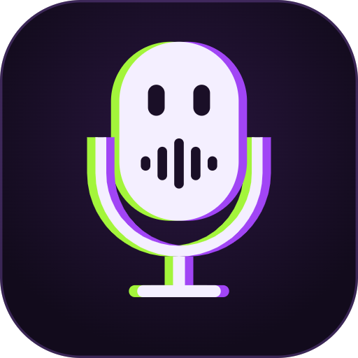
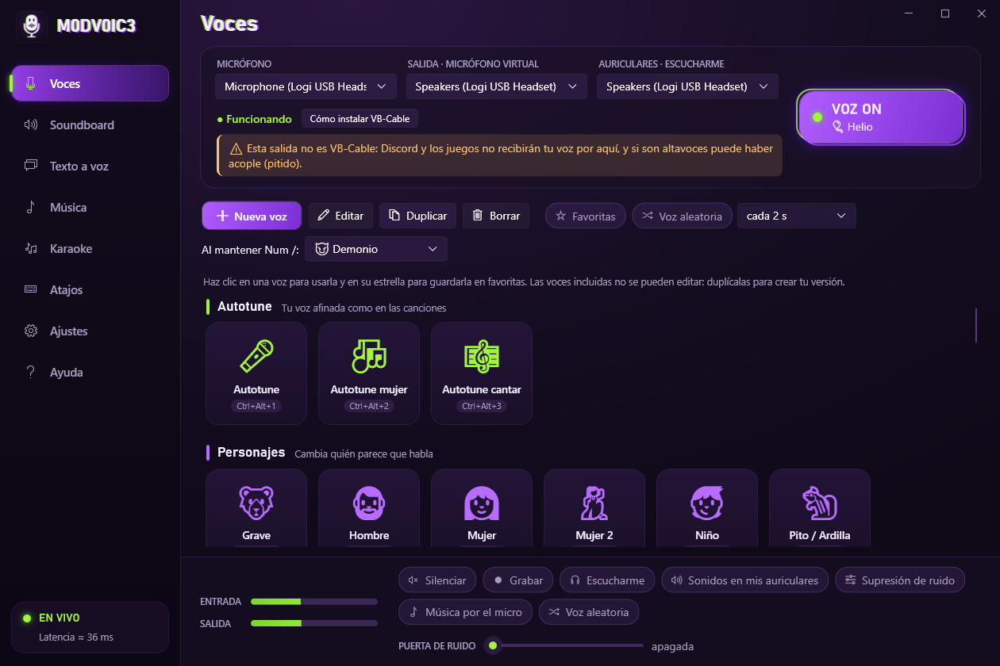

# M0DV0IC3



[](https://github.com/Ayoubdeta/M0DV0IC3/actions/workflows/ci.yml)
[](https://github.com/Ayoubdeta/M0DV0IC3/releases/latest)
[](LICENSE)

> **English:** M0DV0IC3 is a free, open-source real-time voice changer for Windows, similar to Voicemod. It works as a microphone in Discord, games and call apps through VB-Audio Virtual Cable. It includes 64 voices (among them a hard-tune autotune, and female, child or deep voices that adapt to your own pitch), a hold-to-switch voice key, a random voice mode, a karaoke mode for Spotify (vocal removal and synced lyrics), text-to-speech through the microphone with Windows voices, recording of what goes out through the microphone, a soundboard, noise suppression and streaming another app's audio (such as Spotify) through the microphone. Download the ZIP from [Releases](https://github.com/Ayoubdeta/M0DV0IC3/releases/latest), extract it and run `M0DV0IC3.exe`. The interface is in English or Spanish: choose it in Settings → Idioma · Language (the first time, it follows your Windows language).

Modulador de voz en tiempo real para Windows: cambia tu voz al vuelo (autotune, grave, mujer, robot, helio, fantasma…) y la ofrece como micrófono a Discord, juegos y cualquier app de llamadas. Incluye voz aleatoria, una tecla para cambiar de voz mientras la mantienes, karaoke con Spotify, texto a voz por el micro, grabación, música de Spotify (u otra app) por el micro, soundboard, supresión de ruido (RNNoise), atajos globales, botón de silencio y la opción de escucharte.

La interfaz sigue el logo: barra lateral, fondo morado oscuro, violeta para lo que eliges, lima para lo que está activo y el efecto glitch (copias desplazadas lima y violeta) en los títulos, la voz elegida y el interruptor VOZ ON.



## Descargar

1. En **[Releases](https://github.com/Ayoubdeta/M0DV0IC3/releases/latest)**, descarga `M0DV0IC3-vX.Y.Z-win-x64.zip`.
2. Clic derecho → **Extraer todo…**, y abre **M0DV0IC3.exe** dentro de la carpeta. No hace falta instalar .NET.
3. Sigue la *Puesta en marcha* de aquí abajo para usarlo en Discord y juegos.

Requisitos: Windows 10 (versión 2004 o posterior) u 11, de 64 bits.

**¿Sale «Windows protegió su PC»?** Es el filtro SmartScreen. Sale con los programas que no tienen firma digital, como este, o que aún tienen pocas descargas, aunque sean completamente seguros:
- **Para que no salga:** antes de descomprimir, clic derecho en el ZIP → **Propiedades** → marca **Desbloquear** → **Aceptar**.
- **Si ya ha salido:** pulsa **Más información → Ejecutar de todas formas**. Solo pasa la primera vez.

Si un antivirus marca la descarga, es un falso positivo: [cómo avisar para que lo corrijan](SIGNING.md#si-un-antivirus-marca-la-descarga).

Cada versión la compila GitHub Actions directamente desde este código fuente, sin pasar por ningún ordenador personal. Junto al ZIP se publican su huella SHA-256 y una atestación de procedencia, que prueba de qué repositorio y commit sale. Se puede verificar con `gh attestation verify M0DV0IC3-vX.Y.Z-win-x64.zip --repo Ayoubdeta/M0DV0IC3`.

La app solo se conecta a internet en el modo karaoke, para buscar la letra en lrclib.net (envía el artista, el título y la duración de la canción). El texto a voz usa las voces de Windows, sin internet, y las grabaciones se quedan en tu PC. No pide permisos de administrador y solo usa tu micrófono y, si lo activas, el sonido de la app que elijas para «Música por el micro» o el karaoke.

## Puesta en marcha

1. **Instala VB-Audio Virtual Cable** (gratuito): <https://vb-audio.com/Cable/>. Descomprime el zip, ejecuta `VBCABLE_Setup_x64.exe` como administrador y reinicia si te lo pide.
2. En *Panel de sonido* pon **CABLE Input** y **CABLE Output** a **48000 Hz** (Propiedades → Opciones avanzadas). Así Windows no tiene que remuestrear.
3. Abre M0DV0IC3, elige tu **micrófono** y, como salida, **CABLE Input (VB-Audio Virtual Cable)**.
4. En la app donde vayas a hablar, elige **CABLE Output (VB-Audio Virtual Cable)** como micrófono.
   - **Discord** (Ajustes → Voz y vídeo):
     - Dispositivo de entrada: CABLE Output.
     - Desactiva *Krisp* / supresión de ruido y la cancelación de eco de Discord, porque deforman los efectos.
     - Si quieres quitar ruido, usa la supresión de ruido de M0DV0IC3.
   - **Juegos y otras apps:** elige CABLE Output en sus ajustes de micrófono.

## En el móvil

¿Quieres usar las voces en las llamadas del móvil (WhatsApp, Instagram, Azar…)? Se puede con un cable de audio, sin instalar nada en el móvil: **[Cómo conectarlo al móvil](docs/movil.md)**.

## Voces incluidas

| Grupo | Voces |
|---|---|
| Autotune | **Autotune**, **Autotune mujer**, **Autotune cantar** |
| Personajes | Grave, Hombre, Mujer, Mujer 2, Niño, Pito / Ardilla, Helio, Robot, Demonio, Alien, Fantasma, Borracho, Bebé, Abuelo, Abuela, Gigante, Duende, Chica anime, Locutor de radio, Villano espacial, Zombi, Pato, Hada, Bruja, Ogro, Vampiro, Poseído, Voz divina, Insecto, Cíborg, Robot gigante, Androide, Payaso, Hombre lobo |
| Efectos | Susurro, Invertida (al revés), Bajo el agua, Espacial, Radio, Teléfono, Megáfono, Distorsión, Coro, Vocoder, Walkie-talkie, Astronauta, 8 bits, Disco antiguo, Dentro de una lata, Con mascarilla |
| Ambientes | Lejana, Cueva / Eco, Reverb, Delay, Chorus, Flanger, Estadio, Ducha, Catedral, Megafonía |

Ctrl+Alt+1…9 eligen las nueve primeras voces de la lista, en este orden.

Las voces incluidas no se editan: pulsa **Duplicar** y ajusta tu copia en el editor; los cambios se oyen al momento.

**Favoritas.** Pasa el ratón por una voz y pulsa su estrella. El botón **Favoritas** deja ver solo esas, y entonces la voz aleatoria y voz anterior / siguiente eligen solo entre ellas.

**Voces que se adaptan a tu voz.** Mujer, Niño, Bebé, Chica anime, Grave, Gigante y las demás voces de otra edad o de otro sexo tienen un **tono objetivo** (por ejemplo, ~215 Hz para Mujer). La app aprende tu tono medio mientras hablas (lo ves en *Ajustes* y se guarda para la próxima vez) y calcula cuánto subir o bajar. Así suenan igual con una voz grave que con una aguda: con un cambio fijo de +5 semitonos, una voz de hombre grave (~90 Hz) se quedaba en ~120 Hz y seguía sonando a hombre.

**Coro, Vocoder y Walkie-talkie.** El coro suma a tu voz copias una octava abajo, una quinta y una octava arriba. El vocoder convierte tu voz en un acorde de sintetizador. El walkie-talkie y el astronauta añaden ruido de radio mientras hablas y pitidos al empezar y al acabar; en silencio no suenan.

**Autotune.** Es el autotune exagerado de los cantantes de reggaetón y trap:
- La corrección es instantánea: la voz salta de nota en nota sin pasar por las intermedias, y el vibrato desaparece.
- Al hablar, las subidas y bajadas de tu voz se amplían 2,2× antes de afinar, así que recorres muchas más notas y suena cantado.
- No toca los formantes: la voz sigue siendo la tuya, sin efecto ardilla.

Hay tres versiones:
- **Autotune**, en La menor.
- **Autotune mujer**, que sube primero la voz 8 semitonos, como Mujer 2.
- **Autotune cantar**, para cantar encima de una canción: escala cromática (vale para cualquier canción) y sin ampliar tu melodía.

En el editor puedes elegir:
- **Escala:** cromática, mayor, menor, menor armónica o pentatónica menor.
- **Tonalidad:** la de serie es La menor, que usa las notas blancas del piano. Si cantas encima de una canción, pon la suya.
- **Velocidad:** instantánea para el efecto robótico; de 50 a 200 ms para una corrección natural.
- **Exagerar melodía:** de 0 (tu melodía tal cual) a 2,5×.

**🎲 Voz aleatoria** (pestaña Voces, o Ctrl+Alt+R): cambia sola de voz cada 2, 5, 10 o 30 s, o a intervalos al azar. Se salta la voz invertida, porque su retardo dejaría un hueco en cada cambio.

**Mantener pulsado para cambiar la voz** (el **-** del teclado numérico): mientras lo mantienes suena la voz que elijas en la pestaña Voces («Al mantener Num -», Demonio de serie), y al soltarlo vuelve la que tenías, o tu voz normal si estaba apagada. Sirve para soltar una broma en mitad de una partida sin tocar la app.

**Música por el micro** (pestaña Música, o Ctrl+Alt+P): lo que suena en Spotify (u otra app que elijas) llega a Discord mezclado con tu voz, con su propio volumen.
- Solo se captura esa app (process loopback de Windows 10 2004 o posterior): ni Discord ni el resto del sistema, así que nadie se oye a sí mismo.
- Tú la sigues oyendo como siempre.
- Si la app se cierra o se reinicia, se vuelve a enganchar sola.

**Voz del cantante** (pestaña Música): cambia la voz de quien canta en la canción que suena (Ardilla, Demonio, Robot, Mujer…) y deja la música como está.
- La voz se separa con el mismo filtro que el karaoke, pasa por su propia cadena de voz y se vuelve a mezclar. Medido con 140 canciones, ~80 % de la voz del cantante coge la voz nueva; la música del centro que va con ella también, y queda algo de la voz original de fondo, ~4,5 dB por debajo de la música.
- La canción cambiada suena en tus cascos y en Discord, y la app (Spotify) se baja en Windows mientras tanto para que no la oigas dos veces.
- Es una voz aparte de la tuya: puedes hablar con tu voz normal mientras el cantante suena como una ardilla. No va a la vez que el karaoke.

**Modo karaoke** (pestaña Karaoke, o Ctrl+Alt+K): pon una canción en Spotify y actívalo.
- La app reconoce la canción (título, artista y por dónde va, con los controles multimedia de Windows) y busca su letra en [LRCLIB](https://lrclib.net). Si está sincronizada, la línea que toca se ilumina y la letra avanza sola; «Antes» y «Después» la ajustan si va desfasada.
- La voz se quita con un filtro que atenúa lo que suena en el centro de la mezcla, solo en la zona de la voz: el bajo y la batería no se tocan, y la canción recupera poco a poco el volumen que pierde al quitar la voz. Medido con 140 canciones con las pistas separadas, la voz baja unos 12 dB y la música pierde 1,6 dB. Se oye mucho menos, pero puede quedar algo de fondo: el eco de la voz y los coros abiertos a los lados.
- La canción sin voz suena en tus cascos (elígelos en «AURICULARES · ESCUCHARME») y en Discord, junto con tu voz. Para que no la oigas dos veces, Spotify se baja al mínimo en Windows mientras tanto y recupera su volumen al apagarlo.
- «Cantar con autotune» elige la voz Autotune cantar.

**Soundboard** (pestaña Soundboard): arrastra tus sonidos (WAV, MP3, OGG, FLAC…) o pulsa «Añadir sonido». Con el engranaje de cada sonido le pones nombre, volumen, atajo y lo **recortas**: arrastra las marcas de inicio y fin sobre la forma de onda, o pulsa «Quitar silencios». El archivo original no se toca y «Sonido entero» lo deshace; «Exportar WAV…» guarda el trozo como archivo nuevo. El **+ del teclado numérico** para todos los sonidos y frases que estén sonando.

**Texto a voz** (pestaña Texto a voz): escribe una frase y pulsa Intro. La dice una voz de Windows (en un Windows en español, Helena, Laura o Pablo) y suena por el micro en Discord o en el juego, con la voz que tengas puesta: Robot, Demonio, Mujer… Funciona sin internet y una frase tarda ~0,1 s en prepararse. Las frases guardadas pueden tener su propio atajo, y entonces suenan al instante en mitad de una partida.

**Grabar** (botón de la barra inferior, o Ctrl+Alt+G): graba lo que sale por el micro, tal y como lo oyen los demás: tu voz con su efecto, los sonidos, las frases y la música del karaoke. Se guarda en MP3 en *Música\M0DV0IC3*; al acabar puedes abrir la carpeta o añadir la grabación al soundboard.

**Idioma** (Ajustes → Idioma · Language): español o inglés. La primera vez sigue el idioma de Windows; al cambiarlo, la app se reinicia sola.

**Atajos** (pestaña Atajos): todos los atajos de teclado globales, agrupados (Voz, Sonidos, Frases, Micro y auriculares, Música, karaoke y grabación, Elegir una voz) y con un buscador que encuentra acciones, sonidos, frases o teclas. Cada fila dice qué hace; las de «Voz 1…9» y «Mantener pulsado» muestran la voz a la que llevan. Funcionan dentro de los juegos; si un juego se ejecuta como administrador, abre M0DV0IC3 también como administrador.

## Latencia

Medida con el motor completo en el PC de desarrollo (`m0dv0ic3-cli engine`, auriculares USB Logitech):

| Tramo | Modo compartido | Modo exclusivo |
|---|---|---|
| Captura del micro | 10 ms | 3 ms |
| Espera en el buffer entre micro y salida (medida muestra a muestra) | ~6 ms | ~4,6 ms |
| Salida | 12 ms | 3 ms |
| **Total con voces sin cambio de tono** (radio, teléfono, eco, megáfono) | **~28 ms** | **~11 ms** |
| + voces con cambio de tono (PSOLA): ~2,4 periodos de tu voz | +11 ms (voz aguda) · +19 ms (voz media) · +27 ms (voz muy grave) | igual |
| + supresión de ruido (RNNoise) | +10 ms | +10 ms |
| + voz invertida (hay que esperar a que acabe cada trozo) | +200 ms | +200 ms |

La app muestra en cada momento su latencia, con el desglose en el tooltip. VB-Cable y Discord añaden la suya propia, que no se cuenta aquí.

- **Para bajar la latencia**, activa el **modo exclusivo** en *Ajustes*. Muchos drivers no ofrecen periodos cortos en el modo compartido de baja latencia (IAudioClient3), y entonces se queda en 10 ms. En modo exclusivo ninguna otra app puede usar ese micrófono directamente. Discord no se ve afectado, porque escucha CABLE Output.
- **Si oyes chasquidos**, sube el *margen anti-cortes*.

## Compilar

Requisitos: .NET 10 SDK. Los paquetes se descargan de nuget.org (lo fija `nuget.config`).

```powershell
dotnet build M0DV0IC3.slnx
dotnet test tests/M0DV0IC3.Tests
dotnet run --project src/M0DV0IC3.App
.\publish.ps1        # pasa los tests y genera publish\M0DV0IC3\ (la app) y el ZIP de descarga con su SHA-256
```

La app se publica como carpeta (autocontenida y precompilada con ReadyToRun) y no como un único .exe comprimido. Un ejecutable que se descomprime solo y suelta DLL en la carpeta temporal es lo que más falsos positivos da en los antivirus.

## Publicar una versión

```powershell
git tag v1.0.1
git push origin v1.0.1
```

El workflow [`release.yml`](.github/workflows/release.yml) compila en GitHub, pasa los tests y crea la release con el ZIP, su SHA-256 y la atestación de procedencia.

## Herramienta de línea de comandos

`tools/M0DV0IC3.Cli` sirve para ajustar voces y diagnosticar dispositivos sin abrir la app:

```powershell
dotnet build tools/M0DV0IC3.Cli -c Release
$cli = "tools\M0DV0IC3.Cli\bin\Release\net10.0-windows\m0dv0ic3-cli.exe"
& $cli voices                                   # voces incluidas
& $cli devices                                  # dispositivos, formatos y periodos admitidos
& $cli process mi_voz.wav salida.wav --voice mujer [--denoise]
& $cli analyze salida.wav                       # tono (f0), nivel y brillo
& $cli bench                                    # CPU, latencia y nivel de cada voz
& $cli probe --seconds 3 [--exclusive]          # abre el micro y mide sus callbacks (no graba nada)
& $cli engine --voice mujer [--exclusive]       # motor completo con tus dispositivos, silenciado: latencia y cortes
& $cli apps                                     # apps con audio que se pueden mandar por el micro
& $cli engine --app spotify                     # lo mismo, mezclando la música de una app y midiendo su nivel
```

## Cómo está hecho

```
micro (WASAPI) → RNNoise → puerta de ruido → voz (PSOLA + efectos) → + soundboard + frases + música de una app → limitador → CABLE Input → grabación
                                                       └→ (voz si "Escucharme") + sonidos y frases → limitador → auriculares
```

| Ruta | Contenido |
|---|---|
| `src/M0DV0IC3.Dsp` | DSP puro en C#: YIN, TD-PSOLA de baja latencia con autotune y vibrato en los granos, susurro por LPC, voz invertida, biquads, ring mod, comb, distorsión, bitcrusher, chorus de 3 voces, flanger, eco, Freeverb, puerta de ruido, limitador; voces y crossfade sin clics. |
| `src/M0DV0IC3.Audio` | WASAPI propio sobre NAudio 3: exclusivo, compartido de baja latencia o compartido con conversión automática. Hilos MMCSS "Pro Audio", ring buffers sin bloqueos con compensación de deriva de reloj, RNNoise por P/Invoke, mezclador del soundboard. **El hilo de audio no reserva memoria** (lo comprueba un test). |
| `src/M0DV0IC3.App` | Interfaz WPF (MVVM): barra lateral, barra de título propia, voces por grupos, editor de voz, soundboard, texto a voz (voces de Windows), música por el micro, karaoke, grabación, atajos globales y bandeja del sistema. El tema (`Themes/Theme.xaml`) no usa animaciones continuas: una sola animación infinita con brillo costaba un 10 % de un núcleo de CPU. |
| `tools/M0DV0IC3.Cli` | Herramientas offline y de diagnóstico. |
| `tests/M0DV0IC3.Tests` | Tono medido tras PSOLA y tras el autotune, latencia real frente a la reportada, cero asignaciones, rendimiento, deriva de reloj, RNNoise, soundboard. |

## Licencia

[MIT](LICENSE) © 2026 Ayoub.

Software de terceros incluido en la descarga, con sus licencias: [THIRD-PARTY-NOTICES.md](THIRD-PARTY-NOTICES.md). Incluye NAudio, RNNoise, RNNoise.Net, CommunityToolkit.Mvvm, H.NotifyIcon y el runtime de .NET. VB-Audio Virtual Cable es donationware de VB-Audio: se instala aparte y no se redistribuye.
