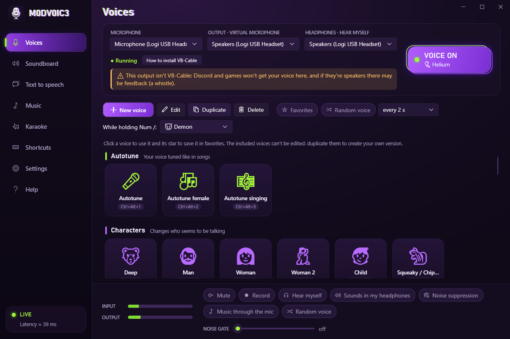

# M0DV0IC3

**English** · [Español](README.es.md)


[](https://github.com/Ayoubdeta/M0DV0IC3/actions/workflows/ci.yml)
[](https://github.com/Ayoubdeta/M0DV0IC3/releases/latest)
[](LICENSE)

A free, open-source real-time voice changer for Windows, similar to Voicemod. It changes your voice on the fly (autotune, deep, woman, robot, helium, ghost…) and offers it as a microphone to Discord, games and any calling app.

It also includes:
- A random voice mode, and a key you hold to switch voice.
- A karaoke mode for Spotify, with vocal removal and synced lyrics.
- *Singer's voice*: it changes the voice of whoever sings in the song that's playing.
- Text-to-speech through the mic.
- Recording, a soundboard and noise suppression (RNNoise).
- Spotify (or any other app) through the mic.
- Global shortcuts, a mute button and the option to hear yourself.

The interface is in English or Spanish.

The look follows the logo:
- A sidebar on a dark purple background.
- Violet for what you select and lime for what is active.
- A glitch effect (offset lime and violet copies) on the titles, the selected voice and the VOICE ON switch.



## Download

1. In **[Releases](https://github.com/Ayoubdeta/M0DV0IC3/releases/latest)**, download `M0DV0IC3-vX.Y.Z-win-x64.zip`.
2. Right-click it → **Extract All…**, and open **M0DV0IC3.exe** inside the folder. You don't need to install .NET.
3. Follow *Getting started* below to use it on Discord and in games.

Requirements: 64-bit Windows 10 (version 2004 or later) or 11.

**Does “Windows protected your PC” show up?** That's the SmartScreen filter. It appears for programs that have no digital signature, like this one, or that don't have many downloads yet, even if they're completely safe:
- **To prevent it:** before extracting, right-click the ZIP → **Properties** → tick **Unblock** → **OK**.
- **If it has already appeared:** click **More info → Run anyway**. It only happens the first time.

If an antivirus flags the download, it's a false positive: [how to report it so they fix it](SIGNING.md#si-un-antivirus-marca-la-descarga) (in Spanish).

Every release is built by GitHub Actions straight from this source code, without going through anyone's computer. The ZIP is published together with:
- its SHA-256 fingerprint;
- a provenance attestation, which proves which repository and commit it comes from.

You can check the attestation with `gh attestation verify M0DV0IC3-vX.Y.Z-win-x64.zip --repo Ayoubdeta/M0DV0IC3`.

**Privacy:**
- The app only connects to the internet in karaoke mode, to look up the lyrics on lrclib.net. It sends the song's artist, title and length.
- Text-to-speech uses the Windows voices, offline, and recordings stay on your PC.
- It doesn't ask for administrator rights.
- It only uses your microphone and, if you turn them on, the sound of the app you choose for “Music through the mic”, karaoke or the singer's voice.

## Getting started

1. **Install VB-Audio Virtual Cable** (free): <https://vb-audio.com/Cable/>. Unzip it, run `VBCABLE_Setup_x64.exe` as administrator and restart if it asks you to.
2. In the *Sound control panel*, set **CABLE Input** and **CABLE Output** to **48000 Hz** (Properties → Advanced). That way Windows doesn't have to resample.
3. Open M0DV0IC3, choose your **microphone** and, as the output, **CABLE Input (VB-Audio Virtual Cable)**.
4. In the app where you're going to talk, choose **CABLE Output (VB-Audio Virtual Cable)** as the microphone.
   - **Discord** (User Settings → Voice & Video):
     - Input device: CABLE Output.
     - Turn off *Krisp* / noise suppression and Discord's echo cancellation, because they distort the effects.
     - If you want to remove noise, use M0DV0IC3's noise suppression.
   - **Games and other apps:** choose CABLE Output in their microphone settings.

To switch the interface language, go to **Settings → Idioma · Language** (English or Spanish). The first time, it follows your Windows language, and when you change it the app restarts by itself.

## On your phone

Want to use the voices in phone calls (WhatsApp, Instagram, Azar…)? You can, with an audio cable and without installing anything on the phone: **[How to connect it to your phone](docs/movil.md)** (in Spanish).

## Built-in voices

| Group | Voices |
|---|---|
| Autotune | **Autotune**, **Autotune female**, **Autotune singing** |
| Characters | Deep, Man, Woman, Woman 2, Child, Squeaky / Chipmunk, Helium, Robot, Demon, Alien, Ghost, Drunk, Baby, Grandpa, Grandma, Giant, Goblin, Anime girl, Radio host, Space villain, Zombie, Duck, Fairy, Witch, Ogre, Vampire, Possessed, Divine voice, Insect, Cyborg, Giant robot, Android, Clown, Werewolf |
| Effects | Whisper, Reversed (backwards), Underwater, Space, Radio, Telephone, Megaphone, Distortion, Choir, Vocoder, Walkie-talkie, Astronaut, 8-bit, Old record, Inside a tin can, With a face mask |
| Ambience | Far away, Cave / Echo, Reverb, Delay, Chorus, Flanger, Stadium, Shower, Cathedral, PA system |

Ctrl+Alt+1…9 pick the first nine voices in the list, in this order.

The built-in voices can't be edited: click **Duplicate** and tweak your copy in the editor. Changes are heard instantly.

**Favorites.** Hover over a voice and click its star. The **Favorites** button shows only those, and then the random voice and previous / next voice choose only among them.

**Voices that adapt to your voice.** Woman, Child, Baby, Anime girl, Deep, Giant and the other voices of another age or sex have a **target pitch** (for example, ~215 Hz for Woman).
- The app learns your average pitch while you talk. You can see it in *Settings*, and it's saved for next time.
- From it, the app works out how much to raise or lower your voice. That way the voices sound the same with a deep voice as with a high one.
- Before, a fixed change of +5 semitones left a deep male voice (~90 Hz) at ~120 Hz, and it still sounded like a man.

**Choir, Vocoder and Walkie-talkie.**
- The choir adds copies of your voice an octave below, a fifth above and an octave above.
- The vocoder turns your voice into a synth chord.
- The walkie-talkie and the astronaut add radio noise while you talk and beeps when you start and finish. In silence they make no sound.

**Autotune.** It's the exaggerated autotune that reggaeton and trap singers use:
- The correction is instant: the voice jumps from note to note without the in-between ones, and vibrato disappears.
- When you talk, the ups and downs of your voice are widened 2.2× before tuning, so you go through many more notes and it sounds sung.
- It doesn't touch the formants: the voice is still yours, with no chipmunk effect.

There are three versions:
- **Autotune**, in A minor.
- **Autotune female**, which first raises the voice 8 semitones, like Woman 2.
- **Autotune singing**, for singing over a song. It uses the chromatic scale (it works for any song) and doesn't widen your melody.

In the editor you can choose:
- **Scale:** chromatic, major, minor, harmonic minor or minor pentatonic.
- **Key:** the default is A minor, which uses the white keys of the piano. If you're singing over a song, set its key.
- **Speed:** instant for the robotic effect; 50 to 200 ms for a natural correction.
- **Exaggerate melody:** from 0 (your melody as it is) to 2.5×.

**🎲 Random voice** (Voices tab, or Ctrl+Alt+R): it switches voice on its own every 2, 5, 10 or 30 s, or at random intervals. It skips the reversed voice, because its delay would leave a gap at every switch.

**Hold to switch voice** (the **-** on the numeric keypad):
- While you hold it, the voice you choose in the Voices tab plays (“While holding Num -”, Demon by default).
- When you let go, the voice you had comes back, or your normal voice if it was off.
- It's handy for dropping a joke in the middle of a match without touching the app.

**Music through the mic** (Music tab, or Ctrl+Alt+P): whatever plays in Spotify (or another app you choose) reaches Discord mixed with your voice, at its own volume.
- Only that app is captured (Windows 10 2004+ process loopback): not Discord or the rest of the system, so nobody hears themselves.
- You keep hearing it as usual.
- If the app closes or restarts, it hooks back on by itself.

**Singer's voice** (Music tab): it changes the voice of whoever sings in the song that's playing (Chipmunk, Demon, Robot, Woman…) and leaves the music as it is.
- How it works: the voice is separated with the same filter as karaoke, goes through its own voice chain and is mixed back in.
- What's left over, measured on 140 songs:
  - ~80 % of the singer's voice gets the new voice.
  - The music in the center goes along with it and gets the effect too.
  - Some of the original voice stays in the background, ~4.5 dB below the music.
- The changed song plays in your headphones and on Discord. Meanwhile, the app (Spotify) is turned down in Windows so you don't hear it twice.
- It's a separate voice from yours: you can talk with your normal voice while the singer sounds like a chipmunk. It can't be used at the same time as karaoke.
- It stays in tune with the song. The singer's pitch only changes in whole octaves: Chipmunk raises it one octave instead of 8 semitones, which would move the melody to another key and clash with the music. The autotune follows every note (not just those of A minor), and the robot sings the melody instead of a single note.
- Measured on a real song: with +8 semitones no note stayed in key; with octaves, 74 % did. The original song scores 81 % with the same measurement.
- Your mic voice doesn't change.

**Karaoke mode** (Karaoke tab, or Ctrl+Alt+K): play a song in Spotify and turn it on.
- The app recognizes the song (title, artist and position, through the Windows media controls) and looks up its lyrics on [LRCLIB](https://lrclib.net). If they're synced, the current line lights up and the lyrics scroll by themselves; “Earlier” and “Later” adjust them if they're out of step.
- The voice is removed with a filter that turns down what sounds in the center of the mix, only in the voice range. The bass and drums are left alone, and the song gradually gets back the volume it loses when the voice is removed.
- Measured on 140 songs with separate tracks, the voice drops by about 12 dB and the music loses 1.6 dB. It's much quieter, but some of it can remain in the background: the voice's echo and backing vocals spread to the sides.
- The song without the voice plays in your headphones (choose them in “HEADPHONES · HEAR MYSELF”) and on Discord, together with your voice. So you don't hear it twice, Spotify is turned all the way down in Windows meanwhile and gets its volume back when you turn karaoke off.
- “Sing with autotune” picks the Autotune singing voice.

**Soundboard** (Soundboard tab): drag in your sounds (WAV, MP3, OGG, FLAC…) or click “Add sound”.
- With each sound's cog you set its name, volume and shortcut.
- You can also **trim** it: drag the start and end markers over the waveform, or click “Trim silences”. The original file isn't touched and “Whole sound” undoes it; “Export WAV…” saves the trimmed part as a new file.
- The **+ on the numeric keypad** stops every sound and phrase that is playing.

**Text to speech** (Text to speech tab): type a phrase and press Enter.
- A Windows voice says it and it plays through the mic on Discord or in the game, with your current voice: Robot, Demon, Woman…
- It works offline, and a phrase takes ~0.1 s to get ready.
- Saved phrases can have their own shortcut, and then they play instantly in the middle of a match.

**Record** (button in the bottom bar, or Ctrl+Alt+G): it records what goes out through the mic, just as others hear it: your voice with its effect, the sounds, the phrases and the karaoke music. It's saved as MP3 in *Music\M0DV0IC3*. When it finishes, you can open the folder or add the recording to the soundboard.

**Language** (Settings → Idioma · Language): English or Spanish. The first time, it follows your Windows language; when you change it, the app restarts by itself.

**Shortcuts** (Shortcuts tab): every global keyboard shortcut.
- They're grouped (Voice, Sounds, Phrases, Mic and headphones, Music, karaoke and recording, Pick a voice), with a search box that finds actions, sounds, phrases or keys.
- Each row says what it does; “Voice 1…9” and “Hold to switch voice” show the voice they lead to.
- They work inside games. If a game runs as administrator, open M0DV0IC3 as administrator too.

## Latency

Measured with the full engine on the development PC (`m0dv0ic3-cli engine`, Logitech USB headset):

| Stage | Shared mode | Exclusive mode |
|---|---|---|
| Mic capture | 10 ms | 3 ms |
| Wait in the buffer between mic and output (measured sample by sample) | ~6 ms | ~4.6 ms |
| Output | 12 ms | 3 ms |
| **Total with voices that don't change pitch** (radio, telephone, echo, megaphone) | **~28 ms** | **~11 ms** |
| + voices that change pitch (PSOLA): ~2.4 periods of your voice | +11 ms (high voice) · +19 ms (medium voice) · +27 ms (very deep voice) | same |
| + noise suppression (RNNoise) | +10 ms | +10 ms |
| + reversed voice (it has to wait for each chunk to end) | +200 ms | +200 ms |

The app always shows its latency, with the breakdown in the tooltip. VB-Cable and Discord add their own, which isn't counted here.

- **To lower the latency**, turn on **exclusive mode** in *Settings*.
  - Many drivers don't offer short periods in low-latency shared mode (IAudioClient3), and then it stays at 10 ms.
  - In exclusive mode no other app can use that microphone directly. Discord isn't affected, because it listens to CABLE Output.
- **If you hear clicks**, raise the *anti-dropout margin*.

## Building

Requirements: .NET 10 SDK. Packages come from nuget.org (set in `nuget.config`).

```powershell
dotnet build M0DV0IC3.slnx
dotnet test tests/M0DV0IC3.Tests
dotnet run --project src/M0DV0IC3.App
.\publish.ps1        # runs the tests and creates publish\M0DV0IC3\ (the app) and the download ZIP with its SHA-256
```

The app is published as a folder (self-contained and precompiled with ReadyToRun), not as a single compressed .exe. An executable that unpacks itself and drops DLLs in the temp folder is what triggers the most antivirus false positives.

The interface texts are written in Spanish, and `src/M0DV0IC3.App/Localization/en.json` holds the English translation (the key is the Spanish text). A test checks that every text has its translation.

## Publishing a release

```powershell
git tag v1.0.1
git push origin v1.0.1
```

The [`release.yml`](.github/workflows/release.yml) workflow builds on GitHub, runs the tests and creates the release with the ZIP, its SHA-256 and the provenance attestation.

## Command-line tool

`tools/M0DV0IC3.Cli` lets you tune voices and diagnose devices without opening the app:

```powershell
dotnet build tools/M0DV0IC3.Cli -c Release
$cli = "tools\M0DV0IC3.Cli\bin\Release\net10.0-windows\m0dv0ic3-cli.exe"
& $cli voices                                   # built-in voices
& $cli devices                                  # devices, supported formats and periods
& $cli process my_voice.wav output.wav --voice mujer [--denoise]
& $cli analyze output.wav                       # pitch (f0), level and brightness
& $cli bench                                    # CPU, latency and level of each voice
& $cli probe --seconds 3 [--exclusive]          # opens the mic and measures its callbacks (records nothing)
& $cli engine --voice mujer [--exclusive]       # full engine with your devices, muted: latency and dropouts
& $cli apps                                     # apps with audio that can be sent through the mic
& $cli engine --app spotify                     # the same, mixing an app's music and measuring its level
```

## How it's built

```
mic (WASAPI) → RNNoise → noise gate → voice (PSOLA + effects) → + soundboard + phrases + an app's music → limiter → CABLE Input → recording
                                                    └→ (voice if "Hear myself") + sounds and phrases → limiter → headphones
```

| Path | Contents |
|---|---|
| `src/M0DV0IC3.Dsp` | Pure C# DSP: YIN, low-latency TD-PSOLA with autotune and vibrato in the grains, LPC whisper, reversed voice, biquads, ring mod, comb, distortion, bitcrusher, 3-voice chorus, flanger, echo, Freeverb, noise gate, limiter, vocal remover and separator; voices and click-free crossfades. |
| `src/M0DV0IC3.Audio` | Custom WASAPI on top of NAudio 3: exclusive, low-latency shared or shared with automatic conversion. MMCSS "Pro Audio" threads, lock-free ring buffers with clock-drift compensation, RNNoise via P/Invoke, soundboard mixer, per-app capture, singer's voice, text to speech and recording. **The audio thread doesn't allocate memory** (a test checks it). |
| `src/M0DV0IC3.App` | WPF interface (MVVM): sidebar, custom title bar, voices by group, voice editor, soundboard, text to speech (Windows voices), music through the mic, karaoke, recording, global shortcuts, system tray, English and Spanish. The theme (`Themes/Theme.xaml`) uses no continuous animations: a single infinite glow animation cost 10 % of a CPU core. |
| `tools/M0DV0IC3.Cli` | Offline and diagnostic tools. |
| `tests/M0DV0IC3.Tests` | Pitch measured after PSOLA and autotune, real versus reported latency, zero allocations, performance, clock drift, RNNoise, soundboard, vocal removal, singer's voice in tune, translations. |

## License

[MIT](LICENSE) © 2026 Ayoub.

Third-party software included in the download, with their licenses: [THIRD-PARTY-NOTICES.md](THIRD-PARTY-NOTICES.md). It includes NAudio, RNNoise, RNNoise.Net, CommunityToolkit.Mvvm, H.NotifyIcon and the .NET runtime. VB-Audio Virtual Cable is donationware by VB-Audio: it's installed separately and isn't redistributed.
