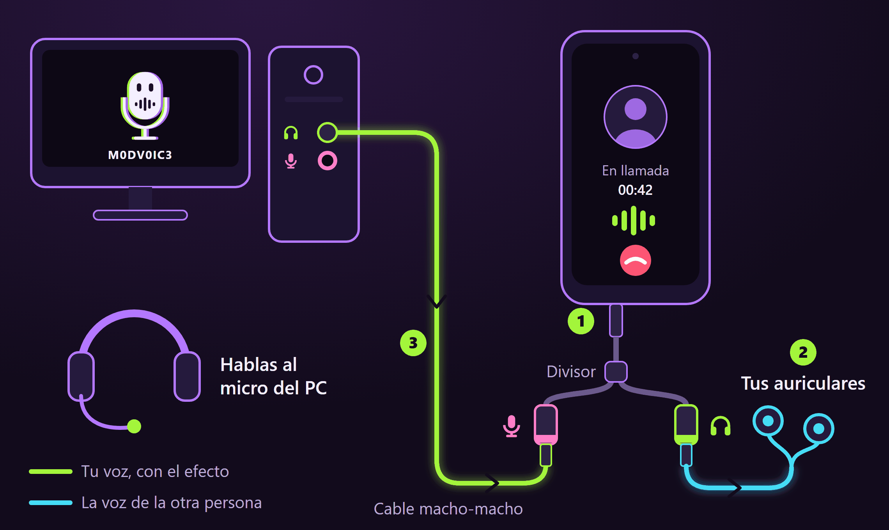
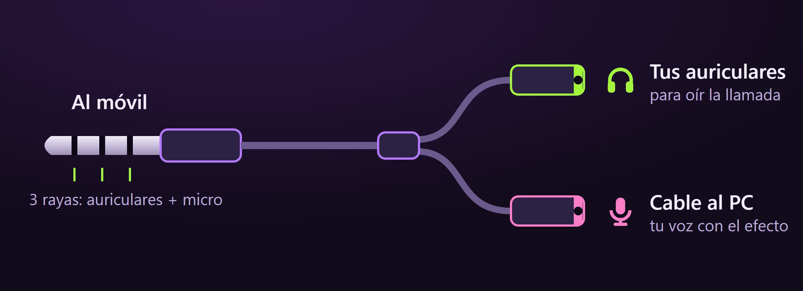
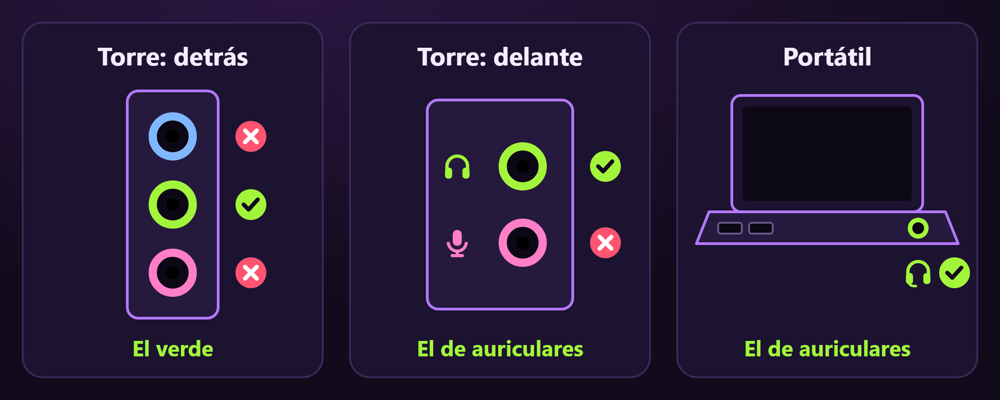
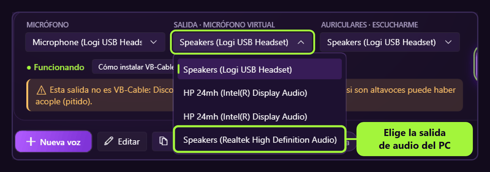
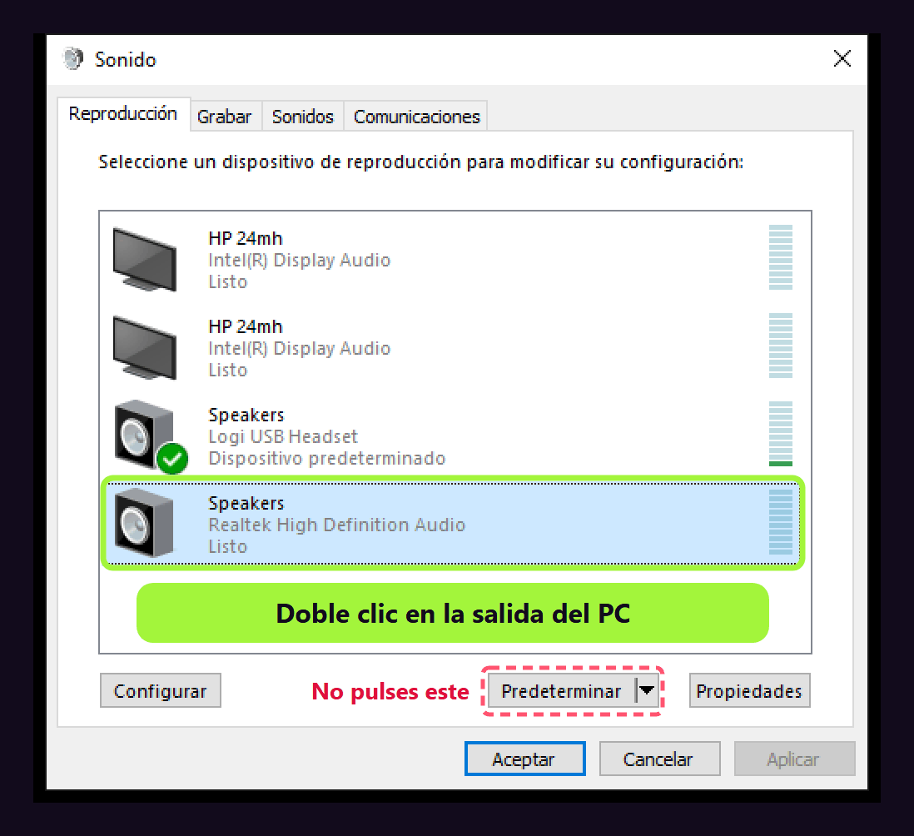
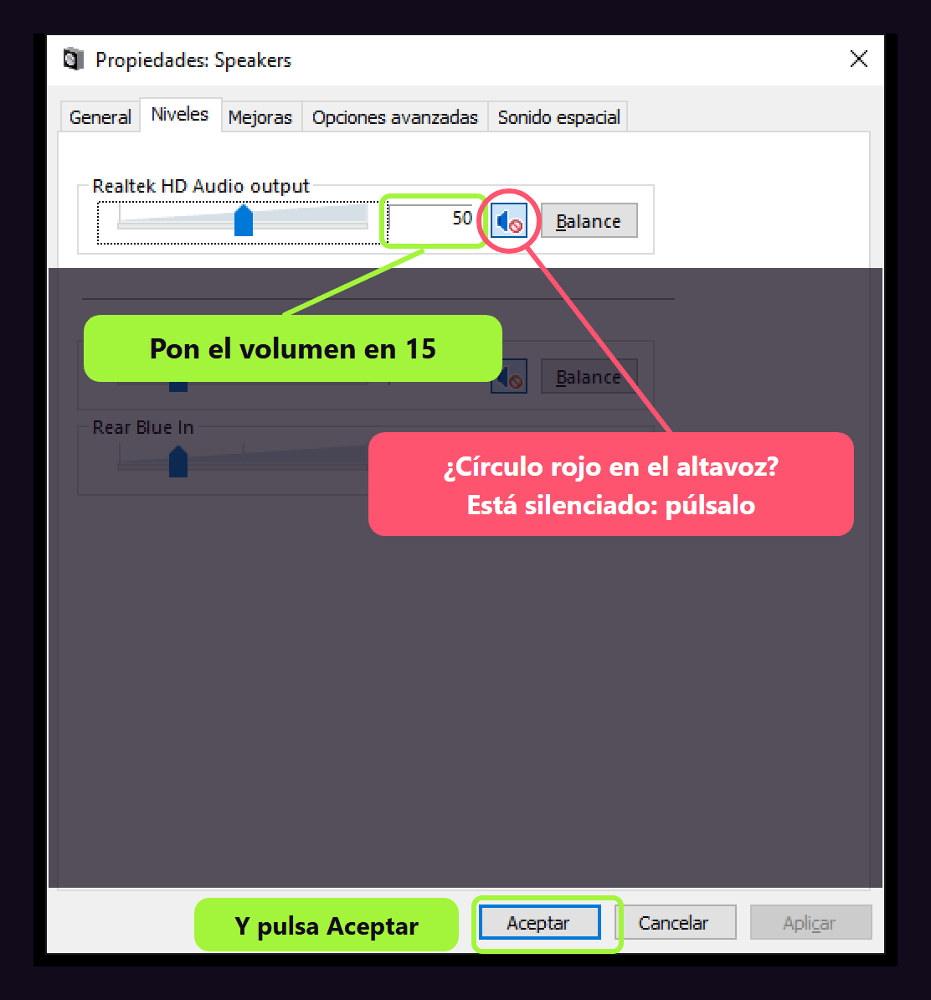

# Usar M0DV0IC3 en el móvil

Con un cable de audio puedes usar las voces de M0DV0IC3 en las llamadas del móvil: WhatsApp, Instagram, Azar, Discord, Telegram o llamadas normales.

M0DV0IC3 cambia tu voz en el PC y la manda al móvil por la toma de micrófono de los auriculares. Para el móvil es el micro de unos auriculares normales, así que funciona en todas las apps y no hay que instalar nada en él.

Sin cable no se puede: ni Android ni iPhone dejan que una app haga de micrófono para las demás.

## Qué necesitas

- **Un divisor de jack de auriculares y micrófono** (unos 3-6 €). Tiene un macho y dos hembras: una para los auriculares y otra para el micro. Es el adaptador que se usa para conectar unos cascos de PC a un móvil.
- **Un cable jack 3,5 mm macho-macho** (unos 2-4 €).
- **Unos auriculares con jack**, para oír a la otra persona.
- Solo si tu móvil no tiene jack: **un adaptador de USB-C (o Lightning) a jack 3,5 mm que admita micrófono**.
- **Una salida de audio libre en el PC.** Si tus cascos del PC son USB o Bluetooth, la salida de auriculares del PC está libre. Si ya tienes ahí unos cascos con jack, usa otra salida: la de detrás de la torre o una tarjeta de sonido USB barata.

El macho del divisor tiene que tener **tres rayas**: así lleva auriculares y micrófono. Si tiene dos, solo lleva auriculares y no sirve.

## 1. Conecta los cables

Sigue los números del esquema de arriba:

1. Enchufa el divisor al móvil.
2. En la hembra de **auriculares** del divisor, enchufa tus auriculares.
3. Con el cable macho-macho, une la hembra de **micrófono** del divisor con la **salida de audio del PC**.

En el PC, el cable va en el jack **verde** o en el de **auriculares**. El rosa no sirve, porque es una entrada.

Si Windows o el programa de la tarjeta de sonido te preguntan qué has conectado, elige **Auriculares**.

> Usa siempre auriculares, no el altavoz del móvil: si tu micro capta el altavoz, la otra persona se oirá a sí misma con eco.

## 2. Elige la salida en M0DV0IC3

En **SALIDA · MICRÓFONO VIRTUAL**, elige la salida de audio del PC donde has enchufado el cable. Suele llamarse *Speakers*, *Altavoces* o *Auriculares*, seguido del nombre de la tarjeta de sonido (por ejemplo, *Realtek High Definition Audio*).

- Tu micrófono sigue siendo el del PC: habla a él, no al móvil.
- Para esto **no hace falta VB-Cable**. La app avisará de que «Esta salida no es VB-Cable»: es normal.
- Los sonidos del **Soundboard** y la **Música por el micro** también llegan a la llamada.

## 3. Baja el volumen de esa salida

La entrada de micrófono del móvil es muy sensible: con el volumen alto, tu voz llegará distorsionada.

1. Pulsa **Win + R**, escribe `mmsys.cpl` y pulsa **Enter**.
2. En la pestaña **Reproducción**, haz doble clic en la salida donde está el cable. No pulses **Predeterminar**: si lo haces, todos los sonidos del PC irán al móvil.

   

3. En la pestaña **Niveles**, pon el volumen en **15**. Si el altavoz que hay al lado tiene un círculo rojo, la salida está silenciada: púlsalo para quitar el silencio. Después pulsa **Aceptar**.

   

## 4. Prueba con una nota de voz

Antes de llamar a nadie, graba una **nota de voz** en WhatsApp (o con la grabadora del móvil) hablando al micro del PC, y escúchala con los auriculares del divisor.

- Si suena distorsionada, baja el volumen del paso 3. Si suena baja, súbelo.
- Cuando suene bien, ya puedes llamar con cualquier app.

## Si algo falla

| Qué pasa | Qué hacer |
|---|---|
| En la nota de voz se oye tu voz normal, o el ruido de la habitación | El móvil está usando su propio micro. Comprueba que el cable está en la hembra de **micrófono** del divisor y en el jack **verde** o de **auriculares** del PC. |
| El móvil sigue sin usarlo, o hace cosas como si pulsaras el botón de los auriculares (pausa la música, cuelga…) | Algunos móviles no reconocen la salida del PC como un micrófono. Necesitas un adaptador pensado para conectar un PC o una mesa de mezclas al móvil, o una «tarjeta de sonido para móvil» de las que se usan para hacer directos (unos 20 €). |
| No llega nada | Mira que la salida no esté silenciada (paso 3) y que M0DV0IC3 tenga la **VOZ ON**. |
| Se oye un zumbido | Mientras lo uses, carga el móvil con un cargador de pared y no por el USB del PC. |
| La otra persona se oye a sí misma | Usa auriculares en el divisor, no el altavoz del móvil. |

## Para volver a usarlo en el PC

Cuando acabes, vuelve a elegir **CABLE Input** en **SALIDA · MICRÓFONO VIRTUAL** para usar M0DV0IC3 en Discord y en los juegos del PC.
